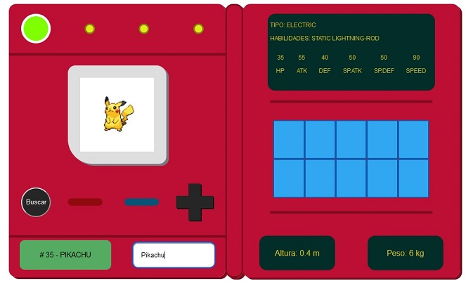

# 04 - JS

## Pokedex

- Creado con JS, CSS y HTML

- Se utilizó la api PokéAPI:
[PokeAPI](https://pokeapi.co/)

- Se puede ingresar al sitio desde el siguiente enlace:
[Pokedex en línea](https://robcg1102.github.io/04JS/)

### Roberto Carro Gastélum